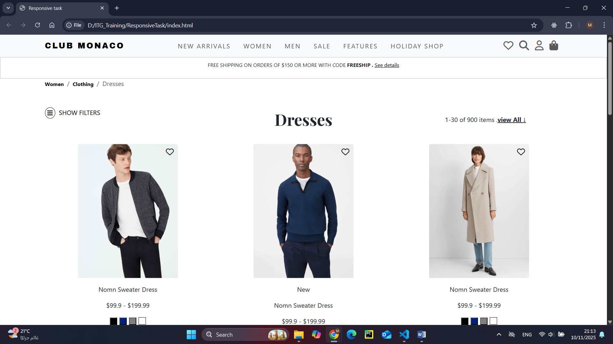
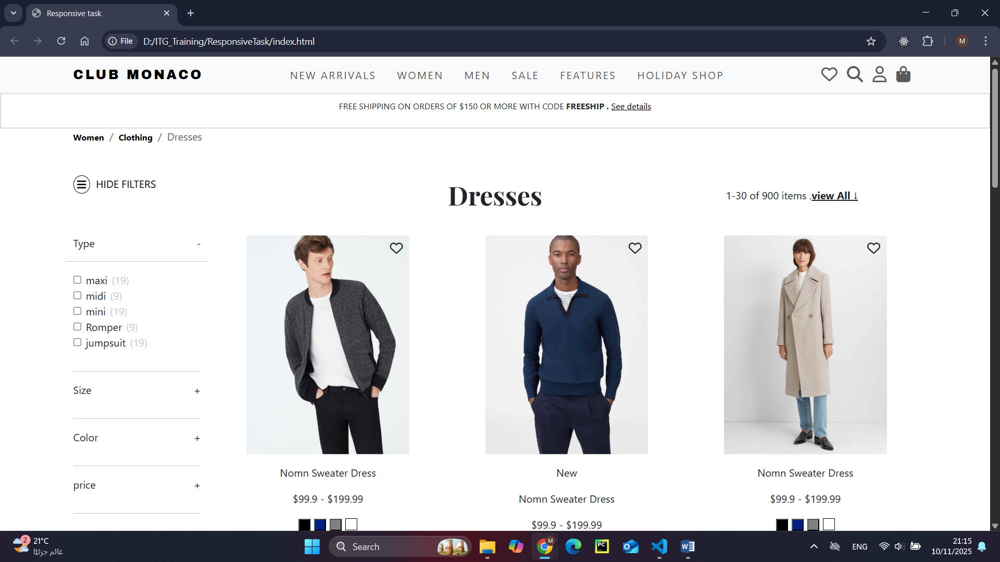
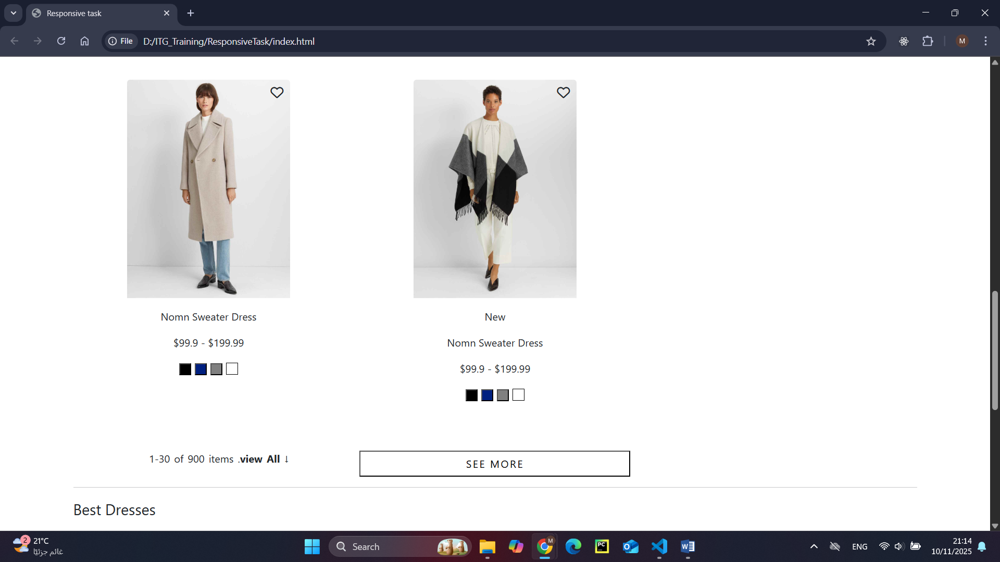
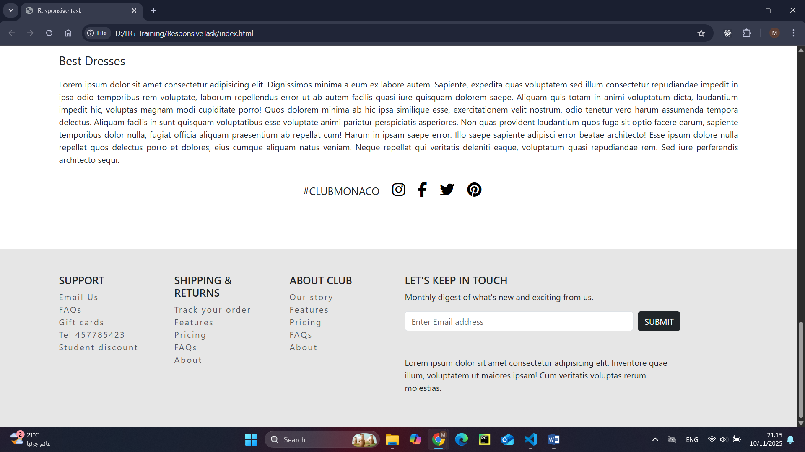

# Responsive Webpage – ITG Training

This is a responsive web application built using **HTML**, **CSS**, **SCSS**, and **JavaScript** as part of my ITG training.

## 🧠 Features
- Fully responsive design
- Clean and modern layout
- Interactive navigation and elements
- Built with HTML5, CSS3, and vanilla JS

<!-- ## 🖥️ Live Demo
👉 [View it on GitHub Pages](https://mirajamous.github.io/ResponsiveTask/) -->

## 📂 Folder Structure
```
ResponsiveTask/
├── index.html
├── style.css
├── style.scss
├── index.js
├── products.js
└── README.md
```

## 📋 How to Run Locally
1. Clone this repository  
   ```bash
   git clone https://github.com/mirajamous/ResponsiveTask.git

2. Open index.html in your browser.


## Preview




